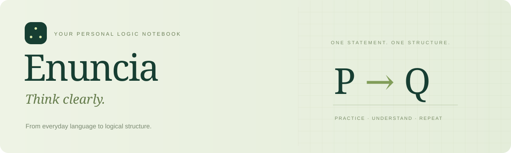

<p align="center">
  
</p>

<p align="center">
  <strong>A personal space to learn propositional logic, one statement at a time.</strong>
</p>

<p align="center">
  
  
  
  
  
</p>

<p align="center">
  <a href="#quick-start">Quick start</a> ·
  <a href="#what-you-can-do">Features</a> ·
  <a href="docs/USER_GUIDE.md">User guide</a> ·
  <a href="docs/DEVELOPMENT.md">Developer guide</a>
</p>

---

Enuncia helps you turn natural-language statements into logical formulas and understand **why** an answer works. Practice with hints, learn from counterexamples, and prepare for your exam with focused mock sessions.

The interface and exercise bank are in **Spanish**. Repository documentation is in English.

## What you can do

| | What Enuncia offers |
| :--- | :--- |
| **Guided practice** | 40 original exercises, supplied atoms, two progressive hints, and explained solutions. |
| **Meaningful correction** | Truth-table equivalence checking accepts different formulas with the same meaning. Incorrect answers receive a concrete counterexample. |
| **Flexible input** | Use the symbol buttons or type `~`, `!`, `&`, `\|`, `->`, and `<->`. |
| **Mock exams** | Ten distinct exercises, an informative timer, saved answers, and a full review after submission. |
| **Personal progress** | Track attempts, first-attempt successes without help, and mistakes to revisit. Export and import backups. |
| **Room to grow** | Add exercises through JSON files and extend the block registry as your course progresses. |

### A learning path with three levels

| Basic | Intermediate | Advanced |
| :---: | :---: | :---: |
| **12 exercises** | **16 exercises** | **12 exercises** |
| Connectives and simple conditions | Necessary and sufficient conditions, scope, and exceptions | Nested implications and conditions about other rules |

## Quick start

**Requirements:** Node.js **22.12 or newer** and npm. The macOS launcher also requires `zsh`, `curl`, and `open`, which are included with macOS.

```sh
git clone https://github.com/jomiferse/enuncia.git
cd enuncia
npm ci
npm run dev
```

Open **[http://127.0.0.1:5173/](http://127.0.0.1:5173/)** in your browser.

> **On macOS:** double-click [`Iniciar.command`](Iniciar.command) to install missing dependencies, start the server, and open the app. Keep its Terminal window open; press **Control+C** to stop the server. If macOS refuses to execute the file, run `chmod +x Iniciar.command`, then `./Iniciar.command` from Terminal.

If your shell selects an older Node installation while Homebrew has a newer version, run `export PATH="/opt/homebrew/bin:$PATH"` before the npm commands.

The server uses a fixed port and binds to `127.0.0.1`. If port 5173 is occupied by another app, it reports an error instead of silently switching to a different origin.

## A first exercise

Suppose the supplied atoms are:

- `P`: I study the theory.
- `Q`: I solve exercises.

For **“I study the theory and solve exercises”**, both `P ∧ Q` and `Q & P` are accepted: they have the same truth table.

If you submit `P ∨ Q`, Enuncia can show a counterexample:

| P | Q | Your formula: P ∨ Q | Expected: P ∧ Q |
| :---: | :---: | :---: | :---: |
| True | False | True | False |

This tells you exactly where the meaning differs. See the [user guide](docs/USER_GUIDE.md) for notation, hints, mock exams, and progress tracking.

## Your progress stays local

Enuncia stores attempts, drafts, consulted hints, and the active mock exam in your browser's `localStorage`. The app requires no account, API key, or remote service, and works offline after its dependencies have been installed and the local server is running.

Use the same browser profile and **`http://127.0.0.1:5173/`** to keep accessing your history. `localhost`, another port, or another browser has separate storage. Back up your progress through **Mi progreso → Exportar** and restore it with **Importar**.

The storage key remains `practica-logica.progress.v1` for compatibility with progress saved before the app was renamed.

## Development

| Command | Purpose |
| :--- | :--- |
| `npm run dev` | Start the local development server on port 5173. |
| `npm test` | Run the logic, exercise-bank, exam-selection, and progress tests. |
| `npm run build` | Type-check the app and build the static site into `dist/`. |
| `npm run preview` | Serve the built site on the same local address and port. |

The tests cover connective truth tables, notation aliases, precedence, ambiguous implication chains, equivalence, counterexamples, exercise distribution, exam selection, history, and progress import/export.

Want to add more practice? Read the [developer guide](docs/DEVELOPMENT.md) for the exercise schema, block registry, grading architecture, and compatibility rules.

## Project background

The original exercises are inspired by the style and difficulty progression of **[ALURA](https://eimtlogica.uoc.edu/alura/)**, the UOC logic learning assistant. Enuncia is an independent project and does not connect to, submit answers to, or modify ALURA assessments.

<p align="center"><sub>Think clearly. Practice deliberately. Keep learning.</sub></p>
